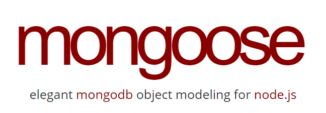

# Mongoose
My works related to Mongoose, an Object Data Modeling (ODM) library for MongoDB and Node.js

## Table of Contents
1. [Introduction.](#introduction)
2. [Official references websites.](#references)
3. [GitHub notes.](#github)
4. [GitHub repository calculation.](#calculation)

<a name="introduction"></a>
## 1. Introduction.
 
Mongoose provides a straight-forward, schema-based solution to model your application data. It includes built-in type casting, validation, query building, business logic hooks and more, out of the box. Mongoose is an Object Data Modeling (ODM) library for MongoDB and Node.js. It manages relationships between data, provides schema validation, and is used to translate between objects in code and the representation of those objects in MongoDB.

<a name="references"></a>
## 2. Official references websites.
Mongoose official website : https://mongoosejs.com <br />
Mongoose official documentation : https://mongoosejs.com/docs/guide.html <br />

**_Mongoose questions and answers website_** <br />
Stack Overflow questions and answers website : https://stackoverflow.com <br />

**_Mongoose documentation by mongoosejs.com_** <br />
Connections by mongoosejs.com : https://mongoosejs.com/docs/connections.html <br />
Deprecation Warnings by mongoosejs.com : https://mongoosejs.com/docs/deprecations.html <br />
Built-in Promises by mongoosejs.com : https://mongoosejs.com/docs/promises.html <br />
Document by mongoosejs.com : https://mongoosejs.com/docs/api/document.html <br />
Middleware by mongoosejs.com : https://mongoosejs.com/docs/middleware.html <br />

**_Mongoose questions and answers by Stack Overflow_** <br />
Mongoose: the function “once” by Stack Overflow : https://stackoverflow.com/questions/17575300/mongoose-the-function-once <br />
Mongoose - Why we make “mongoose.Promise = global.Promise” when setting a mongoose module? by Stack Overflow : https://stackoverflow.com/questions/51862570/mongoose-why-we-make-mongoose-promise-global-promise-when-setting-a-mongoo <br />
Are there still reasons to use promise libraries like Q or BlueBird now that we have ES6 promises? [closed]
 by Stack Overflow : https://stackoverflow.com/questions/34960886/are-there-still-reasons-to-use-promise-libraries-like-q-or-bluebird-now-that-we <br />
 
**_Mongoose related articles_** <br />
Introduction to Mongoose for MongoDB by FreeCodeCamp : https://www.freecodecamp.org/news/introduction-to-mongoose-for-mongodb-d2a7aa593c57/#:~:text=Mongoose%20is%20an%20Object%20Data,of%20those%20objects%20in%20MongoDB.
DeprecationWarning: current Server Discovery and Monitoring engine is deprecated, and will be removed in a future version. To use the new Server Discover and Monitoring engine, pass option { useUnifiedTopology: true } to the MongoClient constructor. #8156 by github.com : https://github.com/Automattic/mongoose/issues/8156 <br />
 
<a name="github"></a>
## 3. GitHub notes.
Clone the current GitHub remote repository contents into local machine.
```
$ git clone https://github.com/syakirharis25/Mongoose.git
$ cd Mongoose/
$ git remote -v
$ git status
```

<a name="calculation"></a>
## 4. GitHub repository calculation.
```
-------------------------------------------------------------------------------
Language                     files          blank        comment           code
-------------------------------------------------------------------------------
Markdown                         1              6              0             31
-------------------------------------------------------------------------------
```
Refer to : https://github.com/syakirharis25/cloc
